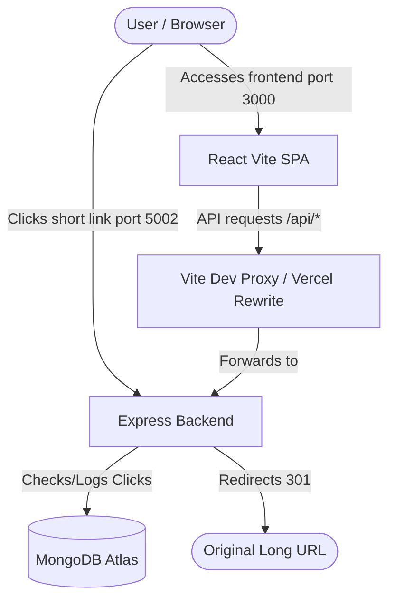

# 📑 SnipLink Project Guide & Interview Preparation

Welcome to the comprehensive guide for **SnipLink**, a full-stack, state-of-the-art URL shortener with real-time analytics. This document is structured to serve as project documentation, a deployment guide, and a preparation manual for your technical viva/interview.

---

## 🔗 1. What SnipLink Does (Features)
SnipLink is a complete web utility designed for modern URL management. It provides:
1. **Instant URL Shortening**: Converts long, messy URLs (e.g., tracking links) into clean, 7-character short codes.
2. **Custom Domain Slugs (Aliases)**: Users can define their own URLs (e.g., `http://localhost:3000/portfolio` instead of a random string like `http://localhost:3000/a3F8s9b`).
3. **Link Expiration**: Allows users to set a lifespan for the link (from 1 day to 1 year), after which the link deactivates.
4. **Real-time Analytics Dashboard**:
   - Total clicks, active links, and link health.
   - Dynamic visual charts depicting link activity over the last 7 days.
   - Detailed device types, operating systems (OS), browser vendors, and traffic referrers.
5. **Interactive QR Codes**: Automatically generates SVG-based QR codes for every shortened URL to simplify sharing.
6. **Link Management**: Allows users to search through their shortened links, toggle their active status (instantly deactivating/reactivating redirection), or delete links.
7. **Dual-Mode Operation**: Guest Mode allows anonymous shortening. Registering for a free account unlocks analytics dashboards and permanent link management.

---

## 🛠️ 2. How SnipLink Works (Technical Architecture)



### The Request Lifecycle
1. **Link Shortening**:
   - The user inputs a URL on the React frontend.
   - The frontend sends a `POST` request to `/api/url/shorten`.
   - The backend checks if the URL is valid, generates a random 7-character base62 short code (using a collision-checked generator), and saves the document in MongoDB.
2. **Redirection & Logging**:
   - When a visitor navigates to `http://localhost:5002/:code`, the Express backend catches the code parameter.
   - It queries MongoDB. If the link exists, is active, and is not expired, the backend increments the URL's click counter and records details using `ua-parser-js` (Browser, OS, Device, Referrer, and IP).
   - The server then returns a `301 Moved Permanently` redirect to the destination URL.

---

## 💻 3. Technology Stack & Key Dependencies

### Frontend (React SPA)
* **React.js & Vite**: Standard for modern web apps. Vite offers ultra-fast hot module replacement.
* **React Router DOM**: Client-side routing so pages load instantly without server roundtrips.
* **Chart.js & react-chartjs-2**: Renders dynamic canvas-based dashboard graphs.
* **react-hot-toast**: Beautiful, animated UI popup notifications.
* **react-icons**: Modular icons library (Feather, FontAwesome).
* **qrcode.react**: Generates responsive, high-performance SVG QR codes.

### Backend (Node.js REST API)
* **Express.js**: Lightweight framework for routing, middlewares, and redirection.
* **Mongoose & MongoDB**: Object Data Modeling (ODM) library and NoSQL database to store dynamic JSON schemas (Users, URLs, Clicks).
* **jsonwebtoken (JWT)**: Secure authentication token strategy.
* **bcryptjs**: Secure one-way hashing function to store user passwords.
* **ua-parser-js**: Extracts user device metadata from request headers.

---

## 🚀 4. How to Host/Deploy SnipLink (Production Settings)

When moving from a local environment (Vite proxy) to production (e.g., Vercel + Render), two things change:
1. The **Vite dev proxy** no longer runs on production build files.
2. We need **client-side fallback routing** so that refreshing `/dashboard` or `/login` on Vercel doesn't return a 404.

### Step 1: Deploy Backend to Render (Free Node.js Hosting)
1. Push your backend code to GitHub.
2. Create an account on [Render.com](https://render.com).
3. Click **New** → **Web Service** and connect your GitHub repository.
4. Set the following details:
   - **Root Directory**: `backend`
   - **Build Command**: `npm install`
   - **Start Command**: `node server.js`
5. Under **Environment Variables**, add the variables from your `.env`:
   - `MONGODB_URI` = `mongodb+srv://...`
   - `JWT_SECRET` = `your_strong_secret`
   - `PORT` = `5000` (Render overrides this automatically, which is fine)
   - `BASE_URL` = `https://your-backend-name.onrender.com` (Your Render deployment URL)
   - `FRONTEND_URL` = `https://your-frontend-name.vercel.app` (Your Vercel deployment URL)
6. Click **Deploy**. Copy your Render backend URL (e.g. `https://sniplink-api.onrender.com`).

---

### Step 2: Configure & Deploy Frontend to Vercel (Free React Hosting)

To allow Vercel to route `/api/*` requests to Render and prevent 404s on route refresh, we must create a `vercel.json` file in the frontend folder.

#### 1. Create [vercel.json](file:///Users/aryankansal/Desktop/untitled%20folder%202/frontend/vercel.json)
Create this new file inside the `frontend` root directory:
```json
{
  "rewrites": [
    {
      "source": "/api/:path*",
      "destination": "https://your-backend-name.onrender.com/api/:path*"
    },
    {
      "source": "/:path*",
      "destination": "/index.html"
    }
  ]
}
```
*(Replace `https://your-backend-name.onrender.com` with your real Render backend URL).*

#### 2. Push and Deploy to Vercel
1. Sign up on [Vercel.com](https://vercel.com).
2. Connect your GitHub repo.
3. Configure project settings:
   - **Root Directory**: `frontend`
   - **Framework Preset**: `Vite`
   - **Build Command**: `npm run build`
   - **Output Directory**: `dist`
4. Click **Deploy**. Vercel will build the React bundles and serve them with rewriting support.

---

## 🎓 5. Sample Viva / Interview Questions & Answers

### Q1: What is a "Sparse Index" in MongoDB, and why did you use it?
> **Answer**: In MongoDB, a unique index prevents duplicate values in a field. However, in our URL shortener, guest users shorten links without custom aliases, meaning `customAlias` is omitted. If we used a standard unique index, MongoDB would only allow a single document with a missing/undefined custom alias. By setting `sparse: true`, we tell MongoDB to only enforce uniqueness on documents where `customAlias` actually exists. We also omit the field rather than saving it as `null` to bypass duplicate index checks.

### Q2: Why did we use HTTP status 301 instead of 302 for redirects?
> **Answer**: `301 Moved Permanently` is optimal for search engine optimization (SEO) because it instructs search crawlers and browsers that the link has moved permanently, transferring link equity. If the redirect was temporary or dynamic, `302 Found` would be preferred. Note that modern browsers aggressively cache `301` redirects, so for active real-time click tracking, `302` or `307` is sometimes substituted to ensure the browser hits our server on every click rather than pulling from local cache.

### Q3: How do you prevent short code collisions in your database?
> **Answer**: Our short code generator ([generateCode.js](file:///Users/aryankansal/Desktop/untitled%20folder%202/backend/utils/generateCode.js)) uses a recursive loop. It generates a 7-character string using base62 character arrays. Before saving, it performs a quick `Url.exists({ shortCode })` query. If it finds a match (collision), it recursively runs again until a unique code is found.

### Q4: Explain how JWT is used for authentication in SnipLink.
> **Answer**: When a user logs in or registers successfully, the server issues a JSON Web Token (JWT) signed with a secret key. The frontend stores this token in `localStorage`. In [api.js](file:///Users/aryankansal/Desktop/untitled%20folder%202/frontend/src/api/api.js), a centralized fetch interceptor extracts this token and attaches it to the HTTP headers as `Authorization: Bearer <token>`. The backend validates the token using an `auth` middleware, attaching the authenticated user ID (`req.userId`) to the request object.

### Q5: How do you handle client-side route protection in React?
> **Answer**: We built a `ProtectedRoute` wrapper component. It uses the `AuthContext` state to verify if the user is logged in. If authenticated, it renders the child pages (like `Dashboard`). If not, it uses React Router's `<Navigate to="/login" replace />` component to redirect the user back to the login page immediately.

---
*(You can print or reference this file during your project presentation or preparation!)*
